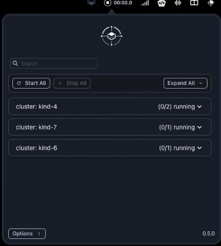
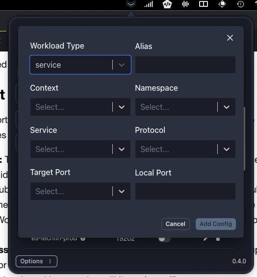
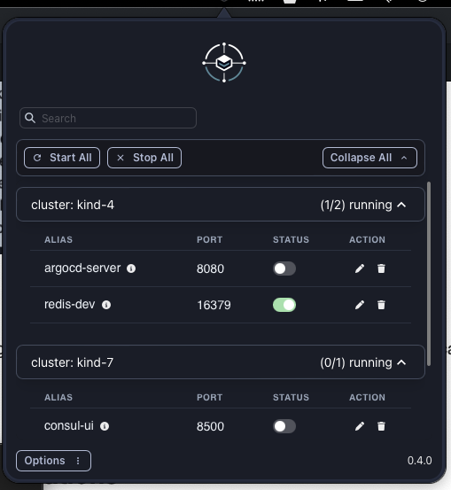
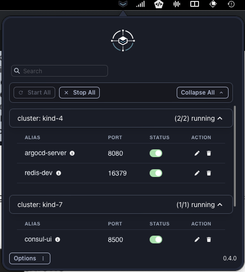
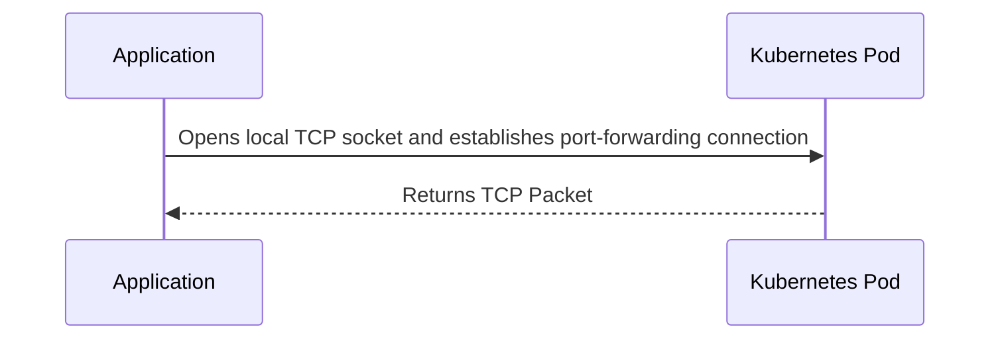
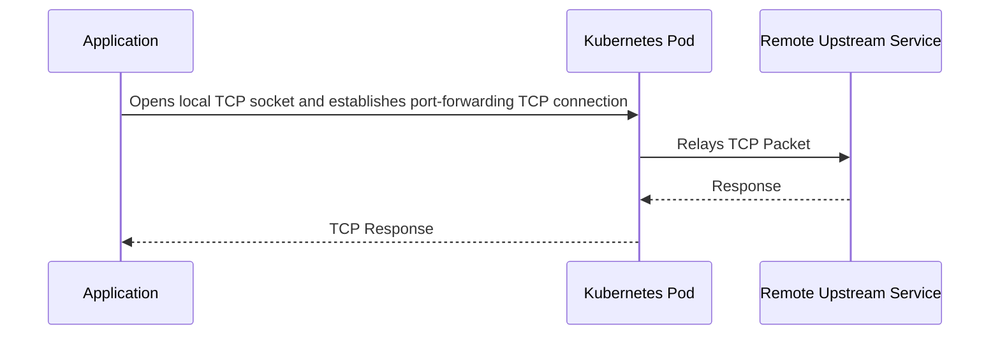
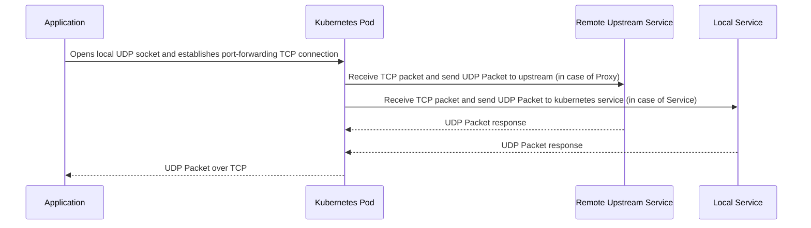

<p align="center">
  <a href="https://nodejs.org/en/">
    
  </a>
  <a href="https://tauri.app/">
    
  </a>
  <a href="https://react.dev">
    
  </a>
  <a href="https://www.rust-lang.org/">
    
  </a>
</p>

<h1 align="center">KFtray</h1>
<h3 align="center">A tray application that manages port forwarding in Kubernetes.</h3>

<p align="center">
  kftray is a system tray application developed with Tauri, Rust, React, Vite, and Chakra UI designed for Kubernetes users. It simplifies the process of initiating and supervising multiple port forwarding configurations through a user-friendly interface.
</br>
</p>

<p align="center">
  
</p>

<h4 align="center">
  <a href="https://github.com/hcavarsan/kftray/releases/latest/download/kftray_0.5.0_universal.dmg">Download for macOS</a> ·
  <a href="https://github.com/hcavarsan/kftray/releases/latest/download/kftray_0.5.0_x64-setup.exe">Download for Windows</a> ·
  <a href="https://github.com/hcavarsan/kftray/releases/latest/download/kftray_0.5.0_amd64.AppImage">Download for Linux</a>
</h4>
- Logo generated by Dall-E

---


## Table of Contents
- [Features](#features)
- [Installation](#installation)
- [Usage](#usage)
- [Architecture](#architecture)
- [Contributing](#contributing)
- [License](#license)

---

### Features

- **Resilient Port Forwarding Connection:** Ensures continuous service even if a pod dies by reconnecting to another running pod automatically.
- **One-Click Multiple Port Forwards:** Set up several port forwarding instances at the same time with a single click, saving time and effort.
- **Independent of Kubectl:** Interfaces directly with the Kubernetes API, eliminating the need for `kubectl` and simplifying port forwarding management.
- **Multi Protocol:** Kftray enables access to internal or external servers through a Kubernetes cluster, offering TCP proxy forwarding and native UDP port forwarding not supported by kubectl.


### Installation

#### Homebrew on macOS and Linux

kftray can be easily installed using Homebrew. First, tap into the custom repository:

Linux:

```bash

brew tap hcavarsan/kftray
brew install --HEAD kftray
```

Mac:

```bash

brew tap hcavarsan/kftray
brew install --HEAD kftray
```

Please refer to the caveats section for instructions on creating a global app in SO after installation.
#### Building from Source

##### Requirements

- Node.js and pnpm or yarn for building the frontend.
- Rust for backend development.

To build `kftray` from source, follow these steps:

1. Clone the repository:
   ```bash
   git clone https://github.com/hcavarsan/kftray.git
   ```
2. Navigate to the cloned directory:
   ```bash
   cd kftray
   ```
3. Install dependencies
   ```bash
   pnpm install
   ```
4. Run the application in development mode:
   ```bash
   pnpm run tauri dev
   ```


### Usage

Below is an illustrated basic guide for KFTRay.

#### Creating Port Forward Configurations

Easily create new port forwarding configurations through the UI by specifying the necessary fields. Each configuration requires the following fields:


- **Workload Type:** The Workload type is Proxy (upstream) or Service (kubernetes local service).
- **Alias:** A unique identifier for the configuration.
- **Context:** The Kubernetes context is a list of contexts configured in the default KUBE_CONFIG.
- **Namespace:** The Kubernetes namespace field is a list of namespaces in the selected context.
- **Service:** If the Workload Type field is a Service, then the values will be a list of services in the chosen namespace.
- **Remote Address:** If the Workload Type field is a Proxy, the value is a url of upstream
- **Protocol:** TCP or UDP protocol
- **Local Port:** The local machine port that will listen for traffic.
- **Remote Port:** The port on the Kubernetes resource that will receive the forwarded traffic.


<details>
<summary><b>Screenshot - Create Service Configuration</b></summary>
<p>



</p>
</details>


#### Start a Single Configuration


Initiate port forwarding for a single configuration with just one click. A green indicator signifies an active connection.

<details>
<summary><b>Screenshot - Start Single Config</b></summary>
<p>



</p>
</details>

#### Start All Configurations

Launch all your saved configurations simultaneously. This is highly efficient when working with multiple services.

<details>
<summary><b>Screenshot - Start All Configs</b></summary>
<p>



</p>
</details>

#### Export Configurations

Export your configurations into a JSON file for backup purposes or sharing with team members.

#### Import Configurations

Import a previously exported JSON configuration file to quickly set up `kftray` on a different machine or environment.

#### Configuration JSON Example

Here is an example of what the exported JSON configuration file might look like:

<details>
<summary><b>Sample Json</b></summary>
<p>

```json
[
  {
    "alias": "consul-ui",
    "context": "kind-7",
    "local_port": 8500,
    "namespace": "consul",
    "protocol": "tcp",
    "remote_port": 8500,
    "service": "consul-ui",
    "workload_type": "service"
  },
  {
    "alias": "redis-gcp",
    "context": "kind-6",
    "local_port": 26379,
    "namespace": "default",
    "protocol": "udp",
    "remote_address": "redis-prod.gcp.internal",
    "remote_port": 6379,
    "workload_type": "proxy"
  }
]
```


</p>
</details>


#### Configs Database

The UI allows you to add, remove, and edit port-forwarding settings with ease. Configurations are saved at $HOME/.kftray/configs.db by default.


### Architeture

#### Kftray relay server

KFtray Server is a simple Golang application that relays traffic (UDP/TCP) from localhost to an upstream server. You can check the code [here](https://github.com/hcavarsan/kftray/tree/main/kftray-server)

#### K8s-Service TCP Forwarding Flow

This process involves the kftray-app client opening a local TCP socket and establishing a port-forwarding connection to the service pod in Kubernetes.



#### Proxy TCP Forwarding Flow

The kftray-app client first deploys the kftray-server pod in Kubernetes, opens a local TCP socket, and establishes a port-forwarding connection to the kftray-server pod. This connection serves as the communication tunnel for sending TCP packets to the kftray-server, which then relays them to the remote upstream service.

Here's the sequence diagram illustrating this process:



#### Proxy and Service UDP Forwarding Flow

Similar to the TCP forwarding flow, the kftray-app client deploys the kftray-server pod in Kubernetes, opens a local TCP socket, and establishes a port-forwarding connection to the kftray-server pod. This connection serves as the communication tunnel for sending UDP packets over TCP to the kftray-server, which then relays them to the appropriate service or remote address.




### Contributing

Contributions are welcome! Here's how you can contribute:
- **Submit Pull Requests**: Feel free to create pull requests for bug fixes, new features, or improvements.
- **Create Issues**: Report bugs, suggest new features, or ask questions.
- **Offer Suggestions**: Your feedback helps improve kftray.

### License

`KFtray` is open-source software licensed under the [MIT License](LICENSE.md). See the LICENSE file for more details.
