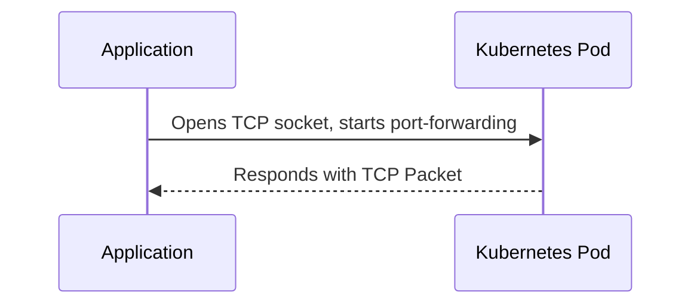
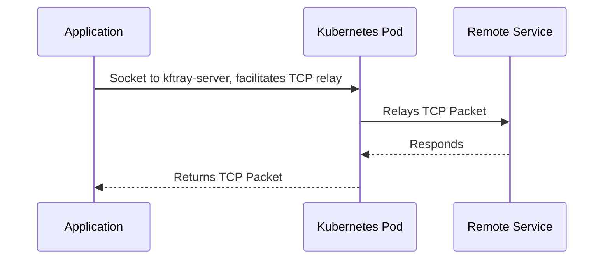
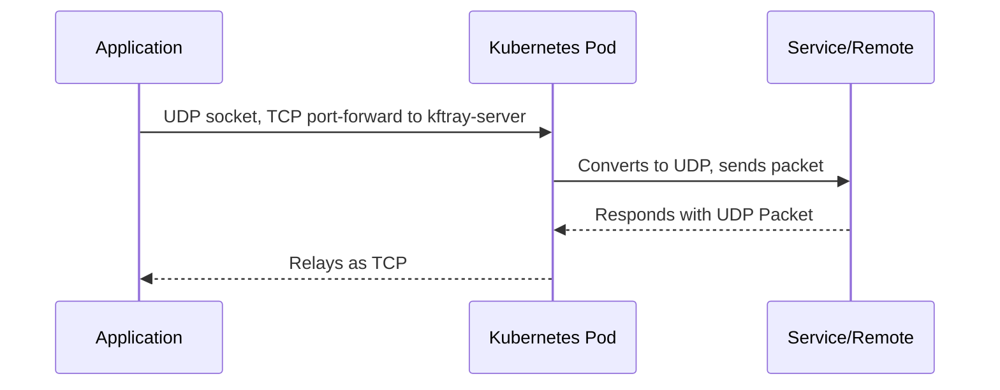

<div align="center">
   
   <h3 align="center"><b>kftray</b></h1>
   <p align="center">
    A cross-platform system tray application for managing multiple kubectl port-forward commands, with support for UDP and proxy connections through k8s clusters.
   </p>

---

   <div align="center">
      <a href="https://nodejs.org/en/">
         
      </a>
      <a href="https://tauri.app/">
         
      </a>
      <a href="https://www.typescriptlang.org/">
         
      </a>
      <a href="https://www.rust-lang.org/">
         
      </a>
      <a href="https://github.com/hcavarsan/kftray/releases/latest">
         
      </a>
   </div>
   <div align="center">
      <a href="https://github.com/hcavarsan/kftray/releases/latest/download/kftray_0.10.6_universal.dmg">
         
      </a>
      <a href="https://github.com/hcavarsan/kftray/releases/latest/download/kftray_0.10.6_x64-setup.exe">
         
      </a>
      <a href="https://github.com/hcavarsan/kftray/releases/latest/download/kftray_0.10.6_amd64.AppImage">
         
      </a>
   </div>
   
   <br />
   
   
   
</div>
<br/>


  <h1>Overview</h1>
  <p>kftray is a cross-platform system tray app made with Tauri (Rust and TypeScript) for Kubernetes users. It simplifies setting up multiple kubectl port forward configurations through a user-friendly interface. Easily store and manage all configurations from local files or GitHub repositories.</p>
    <p><strong>Learn More:</strong> <a href="https://kftray.hashnode.dev/kubernetes-debugging-handling-multiple-kubectl-port-forward-from-tray">Blog Post - Kubernetes Debugging with KFtray</a></p>

### Demo

  <table>
    <tr>
      <td><strong>Kftray Overview</strong></td>
      <td><strong>Demo: GitHub Sync</strong></td>
      <td><strong>Demo: Adding a New Configuration</strong></td>
    </tr>
    <tr>
      <td>
        <a href="https://www.youtube.com/watch?v=9fQO7x4mqn8">
          
        </a>
      </td>
      <td>
        <a href="https://www.youtube.com/watch?v=BAdL7IzaEh8">
          
        </a>
      </td>
      <td>
        <a href="https://www.youtube.com/watch?v=nqEhmcKeCc4">
          
        </a>
      </td>
    </tr>
  </table>
  <br>

## Table of Contents

- [Features](#-features)
- [Installation](#-installation)
- [Usage](#-usage)
- [Architecture](#-architecture)
- [Contributing](#-contributing)
- [License](#-license)


## 🚀 Features

- **Resilient Port Forwarding Connection:** Ensures continuous service even if a pod dies, by reconnecting to another running pod automatically.
- **One-Click Multiple Port Forwards:** Allows for the setup of several port forwarding instances at the same time with a single click.
- **Independent of Kubectl:** Directly interfaces with the Kubernetes API, eliminating the need for `kubectl`.
- **Multi-Protocol Support:** Enables access to internal or external servers through a Proxy Relay server deployed in a Kubernetes cluster, including TCP and UDP port forwarding.
- **Import Configs from Git:** Store and import configurations directly from Git repositories with a few clicks.

## 📦 Installation

KFtray is available for macOS and Linux users via Homebrew, and directly from the GitHub releases page for other systems. Here's how you can get started:

**For macOS**

```bash
brew tap hcavarsan/kftray
brew install --HEAD kftray
```

**For Linux**

```bash
brew tap hcavarsan/kftray
brew install kftray-linux
```
_Please check the caveats section for global app creation instructions after installation._

Linux Note: due to GTK limitations, it is necessary to install and enable the GNOME Shell extension for AppIndicator support to kftray works. See here: https://extensions.gnome.org/extension/615/appindicator-support/

For other systems, visit the [GitHub releases page](https://github.com/hcavarsan/kftray/releases) for downloadable binaries.


## 🧭 Usage

## 🎛 Configuring Your First Port Forward

In a few simple steps, you can configure your first port forward:

1.  **Launch the application**
2.  **Open the configuration panel from the tray icon**
3.  **Add a new configuration:**

    *   Give it a unique alias and set if you want to set the alias as domain to your forward *1
    *    Indicate if the configuration is for a port forward for a service (common use) or a proxy (port forward to an endpoint via a Kubernetes cluster).
    *   Specify the Kubernetes context
    *   Define the namespace housing your service
    *   Enter the service name
    *   Choose TCP or UDP
    *   Set the local and remote port numbers
    *   Configure a custom local IP address (optional)

4. **Activate Your Configuration**: With your configuration saved, simply click on the switch button in the main menu to start the port forward in a single por forward or in Start All to start all configurations at the same time


>Note: To use the alias feature with a local domain name, you must enable write permissions in the hosts file. This method is not secure. We are addressing this in the following issue: [https://github.com/hcavarsan/kftray/issues/171](https://github.com/hcavarsan/kftray/issues/171).
>Follow these steps to allow write access:
>
>For Windows:
>```bash
>icacls "C:\Windows\System32\drivers\etc\hosts" /grant Everyone:(R,W)
>```
>
>For MacOS and Linux:
>```bash
>sudo chmod ugo+rw /etc/hosts
>```


## Export configurations to a JSON file

1.  Open the main menu in the footer
2.  Select the `Export Local File` option
3.  Choose a file name and location to save the JSON file
4.  The JSON file will contain all your current configurations

You can then import this JSON file at any time to restore your configurations.

Example Json configuration File:

```json
[
 {
  "service": "argocd-server",
  "namespace": "argocd",
  "local_port": 8888,
  "remote_port": 8080,
  "context": "test-cluster",
  "workload_type": "service",
  "protocol": "tcp",
  "remote_address": "",
  "local_address": "127.0.0.1",
  "alias": "argocd",
  "domain_enabled": true
 }
]
```


## Sharing the configurations through Git

now, with the local json saved, you can share your configurations with your team members by committing the JSON file to a Github repository. This allows for easy collaboration and synchronization of KFtray configurations across your team.

To import and sync your github configs in kftray:

1.  Open the application's main menu
2.  Select the button with github icon in the footer menu
4.  Enter the URL of your Git repository and path containing the JSON file
5.  If your GitHub repository is private, you will need to enter the private token. Credentials are securely saved in the SO keyring (Keychain on macOS). Kftray does not store or save credentials in any local file; they are only stored in the local keyring.
6.  Select the polling time for when Kftray will synchronize configurations and retrieve them from GitHub.

7.  KFtray will now sync with the Git repository to automatically import any new configurations or changes committed to the JSON file.

This allows you to quickly deploy any port forward changes to all team members. And if someone on your team adds a new configuration, it will be automatically synced to everyone else's KFtray.


## Building from Source

#### Requirements

- Node.js and pnpm or yarn for building the frontend.
- Rust for building the backend.

To compile `kftray`, these steps should be followed:

1. Clone the repository:
   ```bash
   git clone https://github.com/hcavarsan/kftray.git
   ```
2. Navigate to the cloned directory:
   ```bash
   cd kftray
   ```
3. Install dependencies:
   ```bash
   pnpm install
   ```
4. Launch the application in development mode:
   ```bash
   pnpm run tauri dev
   ```

## 🏗 Architecture

### Server

KFtray Server is a Rust application that relays UDP/TCP traffic to an upstream server. Check the source code [here](https://github.com/hcavarsan/kftray/tree/main/crates/kftray-server).

### Forwarding Flows

- **TCP Forwarding:** A local TCP socket, similar to kubectl, can be used to communicate with a Kubernetes pod. This approach offers parallel execution and improved resilience.



- **Proxy TCP Forwarding:** The local TCP connects to the kftray-server pod, which then sends TCP packet to the upstream server.



- **UDP Forwarding:** The KFtray client opens a local UDP socket and connects a local TCP socket to the kftray-server pod. The TCP socket sends UDP packets over TCP, which are then forwarded to the upstream server.



## 👥 Contributing

- 🛠 **Pull Requests**: Feel free to create pull requests for bug fixes, new features, or improvements.
- 📝 **Issues**: Report bugs, suggest new features, or ask questions.
- 💡 **Feedback**: Your feedback helps improve kftray.

## 📄 License

KFtray is available under the [MIT License](LICENSE.md), which is included in the repository. See the LICENSE file for full details.

## Star History

<a href="https://star-history.com/#hcavarsan/kftray&Date">
 <picture>
   <source media="(prefers-color-scheme: dark)" srcset="https://api.star-history.com/svg?repos=hcavarsan/kftray&type=Date&theme=dark" />
   <source media="(prefers-color-scheme: light)" srcset="https://api.star-history.com/svg?repos=hcavarsan/kftray&type=Date" />
   
 </picture>
</a>


## Contributors ✨

Thanks goes to these wonderful people ([emoji key](https://allcontributors.org/docs/en/emoji-key)):

<!-- ALL-CONTRIBUTORS-LIST:START - Do not remove or modify this section -->
<!-- prettier-ignore-start -->
<!-- markdownlint-disable -->
<table>
  <tbody>
    <tr>
      <td align="center" valign="top" width="14.28%"><a href="https://github.com/hcavarsan"><br /><sub><b>Henrique Cavarsan</b></sub></a><br /><a href="https://github.com/hcavarsan/kftray/commits?author=hcavarsan" title="Code">💻</a></td>
      <td align="center" valign="top" width="14.28%"><a href="http://fandujar.dev"><br /><sub><b>Filipe Andujar</b></sub></a><br /><a href="https://github.com/hcavarsan/kftray/commits?author=fandujar" title="Code">💻</a></td>
    </tr>
  </tbody>
</table>

<!-- markdownlint-restore -->
<!-- prettier-ignore-end -->

<!-- ALL-CONTRIBUTORS-LIST:END -->

This project follows the [all-contributors](https://github.com/all-contributors/all-contributors) specification. Contributions of any kind welcome!
