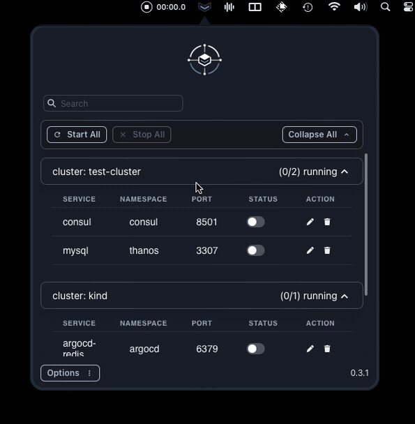

<p align="center">
  <a href="https://nodejs.org/en/">
    
  </a>
  <a href="https://tauri.app/">
    
  </a>
  <a href="https://react.dev">
    
  </a>
  <a href="https://www.rust-lang.org/">
    
  </a>
</p>

<h1 align="center">KFtray</h1>
<h3 align="center">A tray application that manages port forwarding in Kubernetes.</h3>

<p align="center">
  kftray is a system tray application developed with Tauri, Rust, React, Vite, and Chakra UI designed for Kubernetes users. It simplifies the process of initiating and supervising multiple port forwarding configurations through a user-friendly interface.
</br>
</p>

<p align="center">
  
</p>

<h4 align="center">
  <a href="https://github.com/hcavarsan/kftray/releases/latest/download/kftray_0.3.1_universal.dmg">Download for macOS</a> ·
  <a href="https://github.com/hcavarsan/kftray/releases/latest/download/kftray_0.3.1_x64-setup.exe">Download for Windows</a> ·
  <a href="https://github.com/hcavarsan/kftray/releases/latest/download/kftray_0.3.1_amd64.AppImage">Download for Linux</a>
</h4>

---

- Logo generated by Dall-E

## Features

Using `kftray` comes with the following benefits:

- **Resilient Port Forwarding Connection:** Ensures continuous service even if a pod dies by reconnecting to another running pod automatically.
- **One-Click Multiple Port Forwards:** Set up several port forwarding instances at the same time with a single click, saving time and effort.
- **Independent of Kubectl:** Interfaces directly with the Kubernetes API, eliminating the need for `kubectl` and simplifying port forwarding management.

Stay tuned for more features as we continue to enhance `kftray` for an even better Kubernetes management experience.

## Requirements

- Node.js and pnpm or yarn for building the frontend.
- Rust for backend development.

## Installation

### Homebrew on macOS and Linux

kftray can be easily installed using Homebrew. First, tap into the custom repository:

Linux:

```bash

brew tap hcavarsan/kftray
brew install --HEAD kftray
```

Mac:

```bash

brew tap hcavarsan/kftray
brew install --HEAD kftray
```

Please refer to the caveats section for instructions on creating a global app in SO after installation.

### Building from Source

To build `kftray` from source, follow these steps:

1. Clone the repository:
   ```bash
   git clone https://github.com/hcavarsan/kftray.git
   ```
2. Navigate to the cloned directory:
   ```bash
   cd kftray
   ```
3. Install dependencies
   ```bash
   pnpm install
   ```
4. Run the application in development mode:
   ```bash
   pnpm run tauri dev
   ```

## Usage

After building the application, use the following steps to run the application:

1. Navigate to the `src-tauri/target/release/` directory.
2. Execute the binary for your platform (`kftray.exe` on Windows, `./kftray` on macOS and Linux).
3. The application will appear in the system tray.
4. Click the tray icon to open the UI for starting or stopping Kubernetes port forwarding based on your configurations.

## Configuration

The UI allows you to add, remove, and edit port-forwarding settings with ease. Configurations are saved at $HOME/.kftray/configs.db by default.

## Contributing

Contributions are welcome! Feel free to submit pull requests, create issues, or offer suggestions to improve kftray.

## License

`KFtray` is open-source software licensed under the MIT License. For more details, see the [LICENSE](LICENSE.md) file included with this project.
