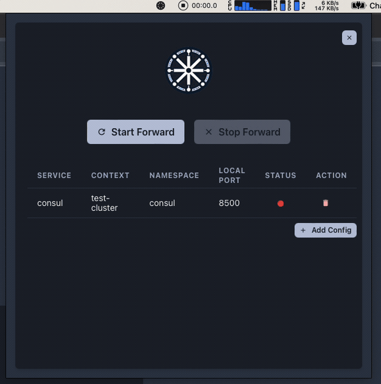

<p align="center">
  <a href="https://nodejs.org/en/">
    
  </a>
  <a href="https://tauri.app/">
    
  </a>
  <a href="https://react.dev">
    
  </a>
</p>

<h1 align="center"> KFtray </h1>
<h3 align="center">A tray application that manages port forwarding in Kubernetes.</h3>
<p align="center">
kftray is a tray application developed with Tauri, Rust, React, Vite, and Chakra UI. It is specifically designed for Kubernetes users to manage port forwarding directly from the system tray. The application simplifies the process of initiating and terminating multiple port forwarding configurations through a user-friendly interface.
</br>
</p>

<p align="center">
! 
</p>

<h5 align="center">
 ·
  <a href="https://github.com/hcavarsan/kftray/releases/latest/download/kftray_0.0.0_x64.dmg">Download for macOS</a> ·
  <a href="https://github.com/hcavarsan/kftray/releases/latest/download/kftray_0.0.0_x64-setup.exe">Download for Windows</a> ·
  <a href="https://github.com/hcavarsan/kftray/releases/latest/download/kftray_0.0.0_amd64.AppImage">Download for Linux</a>
  ·
</h4>


---


- Logo generated by Dall-E

## Requirements
To use `kftray`, ensure that the following requirements are met:
- Node.js and pnpm or yarn installed for building the frontend.
- Rust is installed for backend development.
- Use port-forwarding without installing kubectl and avoid explanations to developers on how to use it

## Installation
### Building from Source
To build `kftray` from source, follow these steps:

1. Clone the repository:
   ```bash
   git clone https://github.com/hcavarsan/kftray.git
   ```
2. Navigate to the cloned directory:
   ```bash
   cd kftray
   ```
3. Install Typescript dependencies and build the React application:
   ```bash
   pnpm install # or yarn install
   pnpm run build # or yarn build
   ```
4. Build the Tauri application:
   ```bash
   pnpm run tauri build
   ```

## Usage
After building the application, use the following steps to run the application:
1. Navigate to the `src-tauri/target/release/` directory.
2. Execute the binary for your platform (`kftray.exe` on Windows, `./kftray` on macOS and Linux).
3. The application will appear in the system tray.
4. Click the tray icon to open the UI for starting or stopping Kubernetes port forwarding based on your configurations.

## Configuration
The application has a user-friendly UI for managing your port-forwarding settings. You can easily add, remove, and edit configurations directly from the UI. By default, all configurations are saved in the path $HOME/.kftray/configs.db

## Development
- For frontend changes, navigate to the root of the project and make your modifications. Use `npm start` or `yarn start` to run the development server.
- For backend (Rust) changes, navigate to the `src-tauri` folder and edit the Rust code. Run `cargo tauri dev` to see those changes in action.


