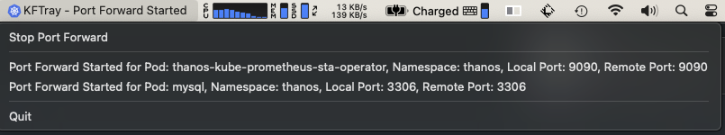
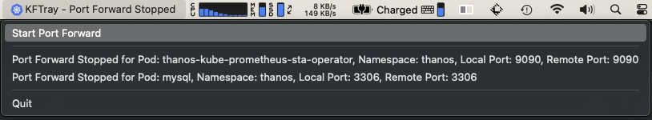
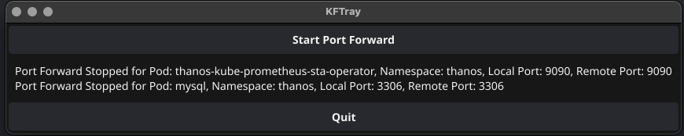

# kftray

`kftray` is a tray application developed in Golang using the Fyne. It is specifically designed for Kubernetes users to conveniently manage port forwarding directly from the system tray. The application simplifies the process of initiating and terminating multiples port forwarding by reading configurations from a JSON file.

## Requirements
To use `kftray`, ensure that the following requirements are met:
-  `kubectl` is installed and properly configured on your system.
- `Go 1.19`

## Installation
### Building from Source
To build `kftray` from source, follow these steps:
1. Clone the repository:
   ```bash
   git clone https://github.com/hcavarsan/kftray.git
   ```
2. Navigate to the cloned directory:
   ```bash
   cd kftray
   ```
3. Install dependencies
   ```bash
   go install
   ```
4. Build the application:
   ```bash
   go build -o kftray main.go
   ```

## Usage
After building the application, use the following steps:
1. Execute the binary:
   ```bash
   ./kftray
   ```
2. The application will appear in the system tray.
3. Click the tray icon to start or stop Kubernetes port forward based on your configuration.

## Configuration
Create a `config.json` file in your home directory at `$HOME/.kftray/config.json` or set the environment variable `KFTRAY_CONFIG` with the complete path to the configuration file. The file should be formatted as follows:

```json
[
  {
    "namespace": "namespace",
    "deployment": "deploymentname",
    "localPort": "8085",
    "remotePort": "8085",
    "kubeconfig": "path-to-kubeconfig"
  },
  {
    "namespace": "namespace2",
    "deployment": "deploymentname2",
    "localPort": "8080",
    "remotePort": "8080",
    "kubeconfig": "path-to-kubeconfig"
  }
]


```
-  `namespace`: Specifies the Kubernetes namespace.
-  `podName`: Specifies the name of the Kubernetes pod.
-  `localPort`: Specifies the local port for forwarding.
-  `remotePort`: Specifies the remote port on the Kubernetes pod.
-  `kubeconfig`: (Optional) Specifies the path to your kubeconfig file.


---

## Screenshots
Below are some screenshots showcasing the `kftray` application in action:

-  **KFTray Started**: 

-  **KFTray Stopped**: 

-  **Window GUI**: 



