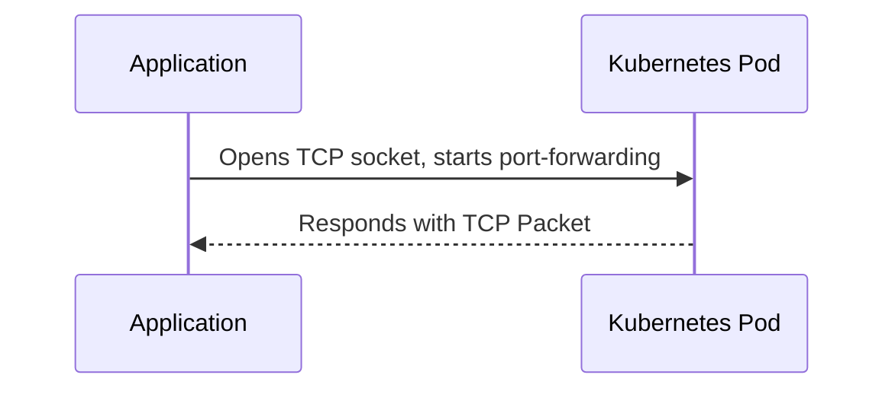
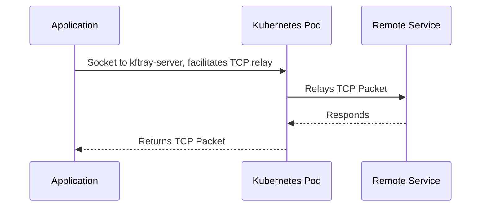
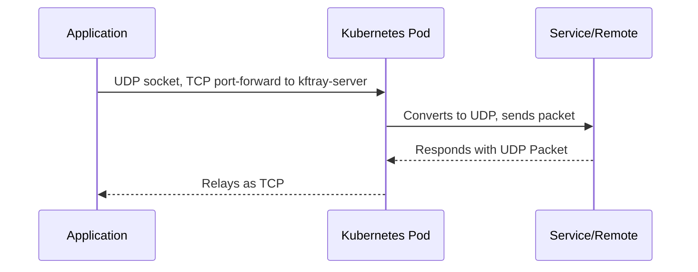

<div align="center">
  
  <h1>KFtray</h1>
  <p>
<h3>A cross-platform system tray app made with Tauri (Rust and TypeScript) for Kubernetes users. It simplifies setting up multiple `kubectl port forward` configurations through a user-friendly interface. Easily store and manage all configurations from local files or GitHub repositories.</h3>
  </p> 
  <br>

  <!-- Badges -->
  <a href="https://nodejs.org/en/">
    
  </a>
  <a href="https://tauri.app/">
    
  </a>
  <a href="https://react.dev">
    
  </a>
  <a href="https://www.rust-lang.org/">
    
  </a>

  <!-- Download Links and Stats -->
  <a href="https://github.com/hcavarsan/kftray/releases/latest">
    
  </a>
  <a href="https://github.com/hcavarsan/kftray/actions">
    
  </a>
  </br>
  </br>
  <!-- Demo GIF -->
  

  <!-- Download Buttons -->
  <p>
    <a href="https://github.com/hcavarsan/kftray/releases/latest/download/kftray_0.7.0_universal.dmg">
      Download for macOS
    </a> ·
    <a href="https://github.com/hcavarsan/kftray/releases/latest/download/kftray_0.7.0_x64-setup.exe">
      Download for Windows
    </a> ·
    <a href="https://github.com/hcavarsan/kftray/releases/latest/download/kftray_0.7.0_amd64.AppImage">
      Download for Linux
    </a>
  </p>
</div>

## Table of Contents

- [Features](#-features)
- [Installation](#-installation)
- [Usage](#-usage)
- [Architecture](#-architecture)
- [Contributing](#-contributing)
- [License](#-license)

---

## 🚀 Features

- **Resilient Port Forwarding Connection:** Ensures continuous service even if a pod dies, by reconnecting to another running pod automatically.
- **One-Click Multiple Port Forwards:** Allows for the setup of several port forwarding instances at the same time with a single click.
- **Independent of Kubectl:** Directly interfaces with the Kubernetes API, eliminating the need for `kubectl`.
- **Multi-Protocol Support:** Enables access to internal or external servers through a Proxy Relay server deployed in a Kubernetes cluster, including TCP and UDP port forwarding.
- **Import Configs from Git:** Store and import configurations directly from Git repositories with a few clicks.

## 📦 Installation

#### Homebrew on macOS and Linux

Install kftray with ease using Homebrew by tapping into the custom repository. Run the following commands:

For Linux:

```bash
brew tap hcavarsan/kftray
brew install --HEAD kftray
```

For macOS:

```bash
brew tap hcavarsan/kftray
brew install --HEAD kftray
```

_Please check the caveats section for global app creation instructions after installation._

#### Building from Source

##### Requirements

- Node.js and pnpm or yarn for building the frontend.
- Rust for building the backend.

To compile `kftray`, these steps should be followed:

1. Clone the repository:
   ```bash
   git clone https://github.com/hcavarsan/kftray.git
   ```
2. Navigate to the cloned directory:
   ```bash
   cd kftray
   ```
3. Install dependencies:
   ```bash
   pnpm install
   ```
4. Launch the application in development mode:
   ```bash
   pnpm run tauri dev
   ```

## 🧭 Usage

Below is an intuitive guide to getting started with KFtray.

### 🎛 Configure Port Forwards

Use the UI to add new port forward settings. Necessary details include:

- `Workload Type`: Proxy or Service.
- `Alias`: A unique name for the settings.
- `Context`, `Namespace`, `Service`: As per Kubernetes configuration.
- `Remote Address`: For Proxy type workload.
- `Protocol`: TCP or UDP.
- `Local and Remote Ports`: Endpoint details.

<details>
<summary><b>Create Service Configuration Screenshot</b></summary>
<p align="center">

</p>
</details>

### ▶️ Activate Configurations

- **Single Configuration:** Click to initiate a single port forward.
- **All Configurations:** Start multiple port forward simultaneously.

<details>
<summary><b>Start Single Configuration Screenshot</b></summary>
<p align="center">

</p>
</details>

### 🗂 Configuration Management

Manage and share port forward settings:

- **Export and Import**: Quickly transfer configurations using JSON files.
- **Git Synchronization**: Seamlessly fetch configurations from a Git repository.
- **Local Storage**: Securely save configurations at `$HOME/.kftray/configs.db`.
- **Server Pod Manifest**: Tailor the Proxy Relay server manifests stored at `$HOME/.kftray/proxy_manifest.json`.


#### Configuration JSON Sample

Below is an example of an exported JSON configuration:

```json
[
  {
    "alias": "consul-ui",
    "context": "kind-7",
    "local_port": 8500,
    "namespace": "consul",
    "protocol": "tcp",
    "remote_port": 8500,
    "service": "consul-ui",
    "workload_type": "service"
  },
  {
    "alias": "redis-gcp",
    "context": "kind-6",
    "local_port": 26379,
    "namespace": "default",
    "protocol": "udp",
    "remote_address": "redis-prod.gcp.internal",
    "remote_port": 6379,
    "workload_type": "proxy"
  }
]
```

## 🏗 Architecture

### Server

KFtray Server is a Rust application that relays UDP/TCP traffic to an upstream server. Check the source code [here](https://github.com/hcavarsan/kftray/tree/main/kftray-server).

### Forwarding Flows

- **TCP Forwarding:** A local TCP socket, similar to kubectl, can be used to communicate with a Kubernetes pod. This approach offers parallel execution and improved resilience.



- **Proxy TCP Forwarding:** The local TCP connects to the kftray-server pod, which then sends TCP packet to the upstream server.



- **UDP Forwarding:** The KFtray client opens a local UDP socket and connects a local TCP socket to the kftray-server pod. The TCP socket sends UDP packets over TCP, which are then forwarded to the upstream server.



## 👥 Contributing

- 🛠 **Pull Requests**: Feel free to create pull requests for bug fixes, new features, or improvements.
- 📝 **Issues**: Report bugs, suggest new features, or ask questions.
- 💡 **Feedback**: Your feedback helps improve kftray.

## 📄 License

KFtray is available under the [MIT License](LICENSE.md), which is included in the repository. See the LICENSE file for full details.

## Stargazers over time

[](https://starchart.cc/hcavarsan/kftray)


