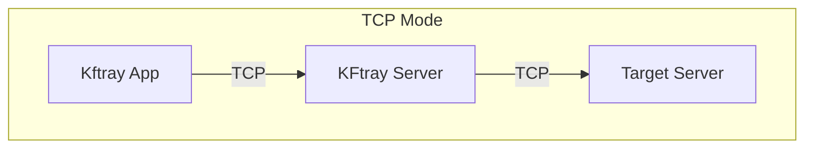
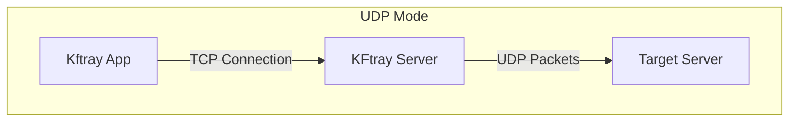
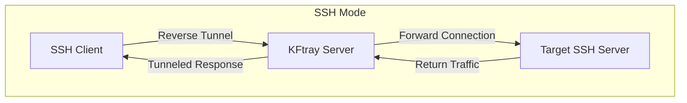

# KFtray Server

A network proxy server written in Rust that forwards traffic between clients and target servers.

## Introduction

KFtray Server helps solve network connectivity issues by acting as an intermediary between clients and servers. It can handle TCP, UDP, and SSH protocols.

## How It Works

The server operates in three modes:







## Configuration

The server uses environment variables for configuration:

```bash
REMOTE_ADDRESS=target.host    # The address of your target server
REMOTE_PORT=8080             # The port on your target server
LOCAL_PORT=8080             # The port KFtray listens on
PROXY_TYPE=tcp             # Either 'tcp', 'udp', or 'ssh'
```

## Running with Docker

```bash
docker run -e REMOTE_ADDRESS=target.host \
          -e REMOTE_PORT=8080 \
          -e LOCAL_PORT=8080 \
          -e PROXY_TYPE=tcp \
          -p 8080:8080 \
          kftray-server
```


## Links

Documentation: [kftray.app](https://kftray.app)

Source Code: [github.com/hcavarsan/kftray](https://github.com/hcavarsan/kftray)

