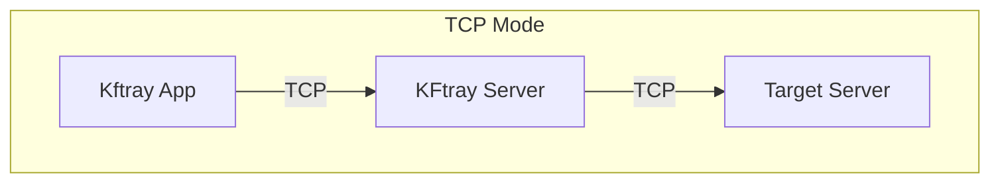
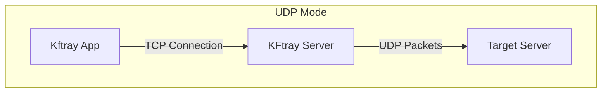

# KFtray Server

A network proxy server written in Rust that forwards traffic between clients and target servers.

## Introduction

KFtray Server helps solve network connectivity issues by acting as an intermediary between clients and servers. It can handle both TCP and UDP protocols,

## How It Works

The server operates in two modes:



In TCP mode, the server creates a direct connection between the client and target server, forwarding all traffic between them.



In UDP mode, the server accepts TCP connections from clients and converts them to UDP packets before sending to the target server. This helps when UDP traffic needs to traverse networks that only allow TCP.

## Configuration

The server uses environment variables for configuration:

```bash
REMOTE_ADDRESS=target.host    # The address of your target server
REMOTE_PORT=8080             # The port on your target server
LOCAL_PORT=8080             # The port KFtray listens on
PROXY_TYPE=tcp             # Either 'tcp' or 'udp'
```

## Running with Docker

```bash
docker run -e REMOTE_ADDRESS=target.host \
          -e REMOTE_PORT=8080 \
          -e LOCAL_PORT=8080 \
          -e PROXY_TYPE=tcp \
          -p 8080:8080 \
          kftray-server
```


## Links

Documentation: [kftray.app](https://kftray.app)

Source Code: [github.com/hcavarsan/kftray](https://github.com/hcavarsan/kftray)

