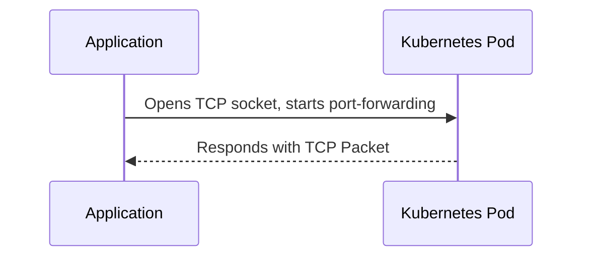
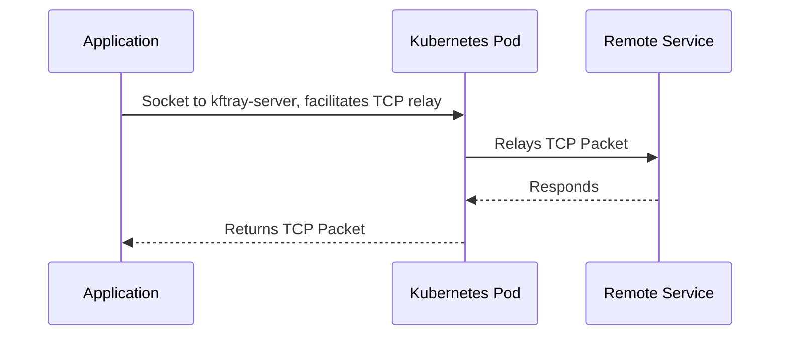
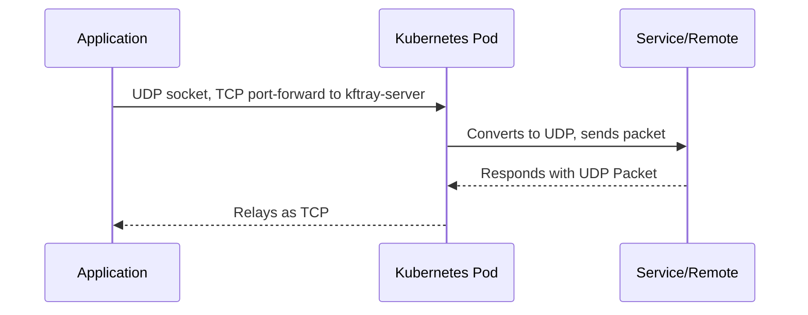

## 🏗 Architecture

### Server

KFtray Server is a Rust application that relays UDP/TCP traffic to an upstream server. Check the source code [here](https://github.com/hcavarsan/kftray/tree/main/crates/kftray-server).

### Forwarding Flows

- **TCP Forwarding:** A local TCP socket, similar to kubectl, can be used to communicate with a Kubernetes pod. This approach offers parallel execution and improved resilience.

- **Proxy TCP Forwarding:** The local TCP connects to the kftray-server pod, which then sends TCP packet to the upstream server.

- **UDP Forwarding:** The KFtray client opens a local UDP socket and connects a local TCP socket to the kftray-server pod. The TCP socket sends UDP packets over TCP, which are then forwarded to the upstream server.

